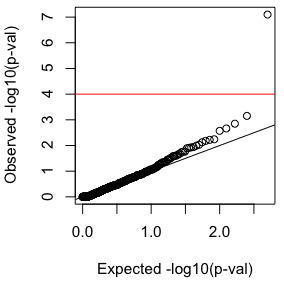
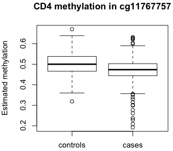

```{r, include = FALSE}
knitr::opts_chunk$set(
  collapse = TRUE,
  comment = "#>"
)
```

In the context of DNA methylation data, Tensor Composition Analysis (TCA) can extract cell-type-specific resolution (individuals by methylation sites by cell types) from tissue-level bulk methylation data (individuals by methylation sites)<sup>[1](#myfootnote1)</sup>. Particularly, TCA can be used for conducting powerful association studies with cell-type-specific resolution and it allows to estimate the cell-type-specific methylation levels of each individual (therefore, it conceptually emulates the scenario in which each individual in the bulk data has been profiled with a single-cell resolution and then signals were aggregated in each cell population of the individual separately).

In this tutorial, we will analyze whole-blood methylation data from the Liu et al. study with rheumatoid arthritis (GEO accession ID GSE42861)<sup>[2](#myfootnote2)</sup>. We will apply TCA for detecting a known cell-type-specific association of RA with methylation in CD4 T-cells, and then we will estimate and inspect the CD4-specific methylation level of each individual in the associated site. Note that this tutorial does not include a formal definition and description of the TCA model; those can be found in the manual of the R package and in the TCA paper<sup>[1](#myfootnote1)</sup>.

## Data and setup

Our analysis is going to include the following five steps:

1. Estimating the cell-type proportions of the individuals in the data (will be required by TCA as an input)
1. Extracting a subset of the methylation sites from the data (for speeding up the runtime of this tutorial)
1. Fitting the TCA model
1. Testing rheumatoid arthritis (RA) status for cell-type-specific associations with methylation
1. Estimating cell-type-specific methylation levels

You will first need to download the following [data files](https://www.dropbox.com/sh/xtlukhjzdhfhesc/AADBFX7atNPlf3hIIliZjo8ka?dl=0):

* GSE42861_processed.txt - processed methylation data from the Liu et al. study (219,096 methylation sites by 658 individuals)
* GSE42861_processed.subset.cpg_identifiers.txt - a list of identifiers for a subset of 500 methylation sites (to be used for subsetting the full data file)
* GSE42861_processed.covariates.txt - known covariates for the individuals in the data
* GSE42861_processed.control_probes_pcs.txt - estimates of the technical variation in the data (see the TCA paper for more details<sup>[1](#myfootnote1)</sup>)

In the first two steps of the analysis, we will be using [glint](https://glint-epigenetics.readthedocs.io), a user-friendly command-line tool for fast analysis of genome-wide DNA methylation data<sup>[3](#myfootnote3)</sup>. The latest release of glint can be found [here](https://github.com/cozygene/glint/releases). glint will allow us to estimate cell-type proportions, which we will then provide to the R code as an input. In order to speed up the total runtime of this tutorial, we will also use glint for extracting only a small subset of the methylation sites from the full data matrix.

If you wish, you may skip the first two steps of the analysis, in which case you may ignore the full data file for now ('GSE42861_processed.txt') and download the results of the first two steps (from [here](https://www.dropbox.com/sh/xtlukhjzdhfhesc/AADBFX7atNPlf3hIIliZjo8ka?dl=0) under the directory 'glint_output'):

* 'GSE42861_processed.houseman_estimates.txt' - estimates of the cell-type proportions (658 individuals, 7 cell types)
* 'GSE42861_processed.subset.txt' - a subset of the processed methylation data (500 methylation sites by 658 individuals)

Finally, before starting the analysis, make sure to install the TCA R package:
```r 
install.packages("TCA")
```

## Step 1: Estimating cell-type proportions

TCA requires measurements or estimates of the cell-type proportions of the individuals in the data. As we later note, TCA allows to re-estimate the cell-type proportions; this can be particularly useful in cases where we can obtain only very noisy estimates of the cell-type proportions.

Here, we use glint for estimating leukocyte proportions for each of the individuals in the whole-blood data following the Houseman et al. reference-based algorithm<sup>[4](#myfootnote4)</sup>. We run the following in the terminal / command line:
```
python glint.py --datafile GSE42861_processed.txt --houseman --out GSE42861_processed
```
This results in a file named 'GSE42861_processed.houseman_estimates.txt', which includes the cell-type proportion estimates.


#### Notes

The Houseman et al. algorithm requires methylation reference for the studied tissue (i.e. methylation collected from sorted cells of the cell types composing the same tissue type under study). While glint allows to specify methylation reference for tissues other than blood (see glint's [documentation](https://glint-epigenetics.readthedocs.io/en/latest/tissueheterogeneity.html#houseman)), such reference will not always be available. In the absence of reference data, a [semi-supervised approach](https://github.com/cozygene/BayesCCE) for estimating cell-type proportions can be taken; note that other reference-free methods currently do not provide cell-type proportion estimates but rather only linear combinations of the cell-type proportions<sup>[5](#myfootnote5)</sup>.

## Step 2: Subsetting the data

In order to speed up the runtime of the following steps in this tutorial, we will extract and analyze only a small subset of the methylation sites in the data.
Specifically, we will consider only the 500 sites listed in the file named 'GSE42861_processed.subset.cpg_identifiers.txt' - 499 of these sites were arbitrarily selected, and one more site was included by design (cg11767757). The latter was verified in the TCA paper to demonstrate a CD4-specific association with RA using sorted CD4 cells and will be used for validating our analysis.

In the terminal / command line run glint for subsetting the full data as follows:
```
python glint.py --datafile GSE42861_processed.txt --include GSE42861_processed.subset.cpg_identifiers.txt --out GSE42861_processed.subset --txtsave
```
This results in a file named 'GSE42861_processed.subset.txt', which includes the 500 pre-selected sites for the 658 individuals in the study.
Note that glint will also output two additional files ('GSE42861_processed.subset.samples.txt' and 'GSE42861_processed.subset.sites.txt') - these can be ignored in our analysis.

## Step 3: Fitting the TCA model

At this point we have obtained estimates of the cell-type proportions ('GSE42861_processed.houseman_estimates.txt') and a subset of the original data file ('GSE42861_processed.subset.txt'). We next fit the TCA model to the subset of the data. Fitting the TCA model essentially means learning the parameters of the TCA model, which will then allow us to both perform association testing (using the function 'tcareg') and estimate cell-type-specific methylation levels (using the function 'tensor').

We start by loading into R the TCA package, the data matrix (X), and the cell-type proportion estimates (W):
```{r eval=FALSE}
library(TCA)
library("data.table")
X <- data.frame(fread(file = "GSE42861_processed.subset.txt"), row.names=1)
W <- data.frame(fread(file = "GSE42861_processed.houseman_estimates.txt"), row.names=1)
```

The analysis of DNA methylation and the interpretation of results may be misleading in the presence of factors that are correlated with changes in methylation. For that reason, TCA allows to specify design variables of the experiment (covariates) that will be accounted for.

TCA allows to account for covariates that may affect methylation biologically at a cell-type-specific level (such as age<sup>[6](#myfootnote7)</sup>) using the argument C1. In addition, TCA allows to consider covariates that may affect the observed mixtures rather than the cell-type-specific methylation levels (such as batch information) using the argument C2.

<!--In our case, we will set the covaraites in the file named 'GSE42861_processed.covariates.txt' (age, sex, and smoking status) as the 'C1' covariates, and we will set the covariates in 'GSE42861_processed.control_probes_pcs.txt' (10 components that reflect technical variation) as the 'C2' covariates:
-->
In our case, we will use age, sex, and smoking status as the C1 covariates, and batch information and 10 components that capture technical variation in the data as the C2 covariates:
```{r eval=FALSE}
covars <- data.frame(
  fread(file = "GSE42861_processed.covariates.txt"), row.names=1)
tech_var <- data.frame(
  fread(file = "GSE42861_processed.control_probes_pcs.txt"),
  row.names=1 )	# principal components calculated from control probes
C1 <- covars[,2:4]	# sex, age, and smoking status
C2 <- cbind(covars[,1],tech_var[,1:10])	# batch information and technical variation
```

Now, we can finally fit the TCA model by running the 'tca' function. We will do so by indicating that we wish 'tca' to use multiple cores (by setting parallel = TRUE; effective only when using a multi-core machine):
```{r eval=FALSE}
tca.mdl <- tca(X = X, W = W, C1 = C1, C2 = C2,
               parallel = TRUE, log_file = "GSE42861.tca.log")
```
After several minutes, 'tca' will save the estimated parameters of the TCA model into the list 'tca.mdl'. In addition, the logs printed to the console will be saved into a file named 'GSE42861.tca.log'.
For a full description of the arguments and the returned values of the 'tca' function, including additional arguments and options not described above, please refer to the package manual.

#### Notes

* The above execution of the function 'tca' is expected to take several minutes. Increasing the size of the input data will increase the runtime linearly with the input size. For instance, if it takes your machine 2 minutes to run 'tca' on the example data with 500 sites, it is expected to require approximately 20 minutes for 5,0000 sites and so on. Allowing parallel computing (the argument 'parallel') provides a substantial decrease in runtime.
* While for each of the covariates included in C2 the 'tca' function learns for each site a single effect size (i.e. one parameter), for each one of the covariates in 'C1', it learns for each site an effect size for each one of the cell types. For example, in our case, we have 7 cell types in W and 3 covariates in 'C1'. Together with the 11 covariates in C2, this results in a total of 32 parameters that the model learns for each site (in addition to the other parameters of the model).
Therefore, it is advised to be mindful of the number of covariates included in the analysis, especially those that are included in C1. As always, the larger the sample size is the higher flexibility we have to include more covariates.
* 'tca' allows to re-estimate the cell-type proportion estimates in W (see argument refit_W in 'tca'). This option is particularly useful when only noisy estimates of the cell-type proportions are available.
Note, however, that 'tca' requires in this case methylation sites that capture the cell-type composition information in the data. Such sites can either be provided as an input or automatically be selected by 'tca' (see argument refit_W.features in 'tca'). In this tutorial, we include in the data only a subset of 500 arbitrary sites, which may not necessarily capture the cell-type composition information in the data. As a result, although in general TCA can improve the estimates of the initial W<sup>[1](#myfootnote1)</sup>, attempting to re-estimate W in the specific case of this tutorial is likely to result in worse estimates of W.
* The TCA package currently does not support files with NA values. If your data includes NA values you would need to impute missing values prior to using TCA.

## Step 4: Looking for cell-type-specific associations with RA

TCA allows us to model a phenotype of interest as statistically related to a given methylation site through cell-type-specific effects. Under this framework, as described below, we can statistically test different hypotheses about the cell-type-specific effects. We refer to this framework as TCA regression (the 'tcareg' function).

We start by loading the rheumatoid arthritis (RA) phenotype.
```{r eval = FALSE}
y <- as.matrix(covars[,5])
```

Much like in a standard regression analysis, TCA regression allows us to account for covariates (the argument C3 in the 'tcareg' function). Notably, we have already taken into account covariates when fitting the TCA model (C1 and C2). However, these were used for modeling the variation in methylation levels. The covariates in C3, on the other hand, can be used to account for factors that may potentially be correlated with the variation of the phenotype.

In our case, we include in C3 the variables age, sex, and smoking, as those are known to be correlated with RA status:
```{r eval = FALSE}
C3 <- covars[,2:4]  # age, sex, and smoking status
```
In addition, since RA is known to be correlated with leukocyte composition in blood, we should consider the cell-type composition in C3. In principle, we can simply do this by including in C3 the cell-type proportions (W). However, here we will use the ReFACTor reference-free algorithm<sup>[7](#myfootnote7)</sup> instead, as it was recently shown that in the context of methylation association studies it provides better correction for cell-type composition (i.e. better control for false positives) compared with reference-based estimates<sup>[8](#myfootnote8)</sup>.

ReFACTor provides a set of principal components that we can include in C3. Importantly, these components are expected to capture the variation in cell-type composition through linear combinations of the cell-type proportions. As a result, while these components can be used for correction (which is invariant to linear combinations), they cannot be used as absolute estimates of the cell-type proportions and therefore should not be given as an input to the function 'tca' (i.e. as the argument W). A more in-depth evaluation and discussion about the output of reference-free and reference-based algorithms is available elsewhere<sup>[5](#myfootnote5)</sup>.

We will use the 'refactor' function for calculating the ReFACTor components. This will require us to use the full data matrix (219,096 methylation sites by 568 individuals). If you wish to skip this step for convenience, you can simply download the results of 'refactor', which can be found in the file named 'GSE42861_processed.refactor_components.txt' under the directory 'refactor_output' together with the rest of the [data files](https://www.dropbox.com/sh/xtlukhjzdhfhesc/AADBFX7atNPlf3hIIliZjo8ka?dl=0).
```{r eval = FALSE}
# if you wish to skip this step, simply load the pre-computed ReFACTor components
ref.scores <- data.frame(
  fread(file = "GSE42861_processed.refactor_components.txt"), row.names=1)

# otherwise, run the followings

# load the full data matrix and run refactor
X.full <- data.frame(
  fread(file = "GSE42861_processed.txt"), row.names=1)
ref <- refactor(X.full, k = 6, sparsity = 500,
                C = cbind(C1,C2), C.remove = TRUE,
                rand_svd = TRUE, log_file = "GSE42861.refactor.log")
ref.scores <- ref$scores
```

For a full description of the arguments and the returned values of the 'refactor' function, including additional arguments and options, please refer to the package manual.

Given the ReFACTor components, we can now construct the final C3, in which we also include the first 6 ReFACTor components<sup>[8](#myfootnote8)</sup>:
```{r eval = FALSE}
C3 <- cbind(C3,ref$scores)
```

Now that we have the covariates we wish to consider in the TCA regression, we should chose a test to perform. The function 'tcareg' allows us to test several different types of hypotheses (tuned by the argument 'test'):

* **Marginal tests** (by setting test = 'marginal') - marginal tests will be performed for each cell type h (separately) as follows. For each site j, its effect size in cell type h will be estimated and tested while assuming zero effects in the rest of the cell types.
* **Conditional marginal tests** (by setting test = 'marginal_conditional') - conditional marginal tests will be performed for each cell type h (separately) as follows. For each site j, its effect size in cell type h will be estimated and tested while also estimating and accounting for the effect sizes in the rest of the cell types.
* **Joint tests** (by setting test = 'joint') - for each site j, the effect sizes of all cell types will be estimated and tested for their joint effect.
* **Joint tests with a single effect size** (by setting test = 'single_effect') - for each site j, the effect sizes of all cell types will be estimated and tested for their joint effect, under the assumption that all effect sizes are equal. In cases where the assumption of equal effect sizes across cell types hold, this test will be more powerful than a joint test (owing to the fact that it uses only one degree of freedom).
* **User-specified custom tests** (by setting test = 'custom') - for each site j, the effect sizes and the joint effect of a user-specified subset of the cell types (specified using the argument 'alternative_model') will be estimated and tested, while accounting for a user-specified background model (specified using the argument 'null_model').

In our case, we wish to test the methylation sites in the data for associations with CD4 cells. In other words, we wish to perform marginal tests for associations with CD4. Since setting "test = 'marginal'" will perform a marginal association test for each of the cell types, we can instead set "test = 'custom'" and define a marginal association test for CD4 by setting 'alternative_model' to be CD4 cells and setting 'null_model' to be 'NULL'. This formulation requires from 'tcareg' that for each methylation site only a single effect for CD4 will be estimated and tested, while assuming no effects in the rest of the cell types - this is exactly a marginal test.

We can now finally test for CD4-specific associations. In order to have a more informative view of the results, we indicate using the optional argument 'features_metadata' that 'tcareg' should include metadata about the methylation sites. Specifically, we will use the metadata file named 'HumanMethylationSites.txt', which is based on the Illumina manifest files and can be found [here](https://github.com/cozygene/TCA/tree/master/assets), and includes information such as chromosome numbers and positions for all the methylation sites in the Illumina human methylation platforms (27K, 450K and 850K/EPIC arrays).
```{r eval = FALSE}
cd4 <- colnames(W)[1] # the first column in W corresponds to CD4
res <- tcareg(X = X, tca.mdl = tca.mdl, y = y, C3 = C3,
              test = "custom", null_model = NULL, alternative_model = c(cd4),
              save_results = TRUE, output = "GSE42861.tcareg.CD4",
              log_file = "GSE42861.tcareg.log",
              features_metadata = "HumanMethylationSites.txt")
```
The 'tcareg' results will be saved into the list 'res'. In addition, since we indicated 'save_results = TRUE', the results will be saved into a file named "GSE42861.tcareg.CD4.custom.txt" (note that the file name is indicated by the argument 'output'). For a full list of the values returned by 'tcareg' and for additional arguments please refer to the package manual.

We can now look at the association results - we start by plotting a quantile-quantile (qq) plot of the p-values:
```{r eval = FALSE}
plot(-log10(seq(from = 1/500, to = 1, by = 1/500)), -log10(sort(res$pvals)),
     xlab = "Expected -log(p-val)", ylab = "Observed -log(p-val)")
abline(a=0, b=1); abline(h=-log10(0.05/500), col="red")
```
This will output the following plot, which shows a single significant hit:

 

Ranking the p-values shows that the association found is with the methylation site cg11767757.
```{r eval = FALSE}
hit.position <- order(res$pvals)[1] # 498
hit <- rownames(X)[hit.position] # cg11767757
hit.pval <- res$pvals[hit.position] # 7.95e-08
```

#### Notes
* Increasing the size of the input data will increase the runtime of the function 'tcareg' linearly with the input size. Allowing parallel computing (the argument 'parallel') can allow a substantial decrease in runtime.
* The application of 'tcareg' for epigenome-wide association studies will often result in a deflation in the test statistic and therefore an inflation in p-values (i.e. more non-significant p-values than expected by chance). In that sense, the p-values returned by 'tcareg' are conservative, yet, 'tcareg' is still able to provide substantially better power than other more standard approaches; for a discussion and more information about the reasons for this inflation please refer to the TCA paper<sup>[1](#myfootnote1)</sup>.
*  In this tutorial we perform a CD4-specific analysis using marginal tests. Importantly, owing to correlations between the proportions of different cell types, marginal tests may be prone to tagging incorrect cell types as associated (i.e. even though a marginal test does control for false positives in finding truly associated sites). In other words, a cell-type-specific association found by a marginal test may in fact be the result of that site being associated though a different cell type<sup>[1](#myfootnote1)</sup>. In principle, a conditional marginal test can be used to alleviate this problem by accounting for the effects of other cell types - by either setting the argument 'test' to 'marginal_conditional' for accounting for all other cell types, or by setting 'test' to 'custom' for accounting for a specific subset of the cell types. That said, for the same reason (i.e. correlations between cell types), a marginal conditional test is expected to be severely underpowered for detecting genome-wide significant associations. Therefore, a more reasonable approach to tackle this issue may be to consider conditional marginal tests as a post-hoc analysis for investigating the cell-type-specific effects of the already-detected set of associated sites.

## Step 5: Estimating cell-type-specific methylation

Finally, we will apply the function 'tensor' for estimating the cell-type-specific methylation levels of the associated site we found in the previous step. 'tensor' requires as an input the parameters of the fitted TCA model for the sites for which we wish to get cell-type-specific estimates. Since we are interested in estimates for just one particular site, we will first use the function 'tcasub' for subsetting the estimated model parameters to include only information about the associated site.
```{r eval = FALSE}
# subset the estimates of the model parameters
mdl.tca.sub <- tcasub(tca.mdl, features = c(hit), log_file = "GSE42861.tcasub.log")

# estimate cell-type-specific methylation for the associated site
Z_hat <- tensor(X = X[hit,], tca.mdl.sub, log_file = "GSE42861.tensor.log")
```
This results in a list 'Z_hat' in which each element includes the estimated cell-type-specific methylation levels for one specific cell type (where the order of cell types is the same as the order of the cell types in W). This allows us, for example, to compare between RA cases and controls based on their estimated CD4-specific methylation levels in cg11767757:
```{r eval = FALSE}
cd4 <- Z_hat[[1]] # the first column in W is CD4, therefore take the first element in Z_hat
hit.cd4 <- cd4[1,]
d <- data.frame(hit.cd4, y)
boxplot(hit.cd4~y, data = d, main="CD4 methylation in cg11767757",
        names=c("controls","cases"), ylab="Estimated methylation")
```

This results in the following boxplots:


 
 
 
#### Notes
* The accuracy of the estimates given by the function 'tensor' depends on the number of different cell types and on their abundances. Particularly, 'tensor' will provide more accurate estimates in cases where fewer cell types are modeled, and in any case, more abundant cell types will be estimated more accurately than less abundant cell types.

___

<a name="myfootnote1">1</a>: Rahmani et al. "Cell-type-specific resolution epigenetics without the need for cell sorting or single-cell biology." Nature Communications, in press (2019).

<a name="myfootnote2">2</a>: Liu et al. "Epigenome-wide association data implicate DNA methylation as an intermediary of genetic risk in rheumatoid arthritis." Nature biotechnology. 2013 Feb;31(2):142.

<a name="myfootnote3">3</a>: Rahmani et al. "GLINT: a user-friendly toolset for the analysis of high-throughput DNA-methylation array data." Bioinformatics. 2017 Feb 8;33(12):1870-2.

<a name="myfootnote4">4</a>: Houseman et al. "DNA methylation arrays as surrogate measures of cell mixture distribution." BMC bioinformatics. 2012 Dec;13(1):86.

<a name="myfootnote5">5</a>: Rahmani et al. "BayesCCE: a Bayesian framework for estimating cell-type composition from DNA methylation without the need for methylation reference." Genome biology. 2018 Dec;19(1):141.

<a name="myfootnote6">6</a>: Horvath "DNA methylation age of human tissues and cell types. Genome biology." 2013 Oct;14(10):3156.

<a name="myfootnote7">7</a>: Rahmani et al. "Sparse PCA corrects for cell type heterogeneity in epigenome-wide association studies." Nature methods. 2016 May;13(5):443.

<a name="myfootnote8">8</a>: Rahmani et al. "Correcting for cell-type heterogeneity in DNA methylation: a comprehensive evaluation." Nature methods. 2017 Mar;14(3):218.
