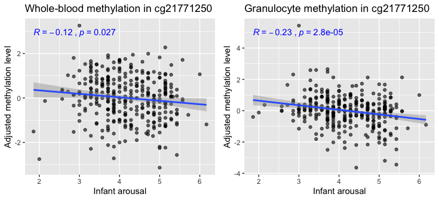

```{r, include = FALSE}
knitr::opts_chunk$set(
  collapse = TRUE,
  comment = "#>"
)
```

Tensor Composition Analysis (TCA) allows the deconvolution of two-dimensional data (features by observations) coming from a mixture of sources into a three-dimensional matrix of signals (features by observations by sources). The TCA framework further allows to test the features in the data for different statistical relations with an outcome of interest while modeling effects at the source level <sup>[1](#myfootnote1)</sup>.

In the context of DNA methylation, TCA allows to model methylation signals at cell-type-specific resolution (individuals by methylation sites by cell types) from tissue-level bulk data (individuals by methylation sites)<sup>[1](#myfootnote1)</sup>.
This is done by explicitly modeling the cell-type level variation in methylation across individuals; in contrast, previous methods for modeling tissue heterogeneity in genomics do not model the intrinsic variability within individuals at the cell-type level.

This tutorial demonstrates how to utilize TCA for a powerful detection of differential methylation at the cell-type level through two detailed step-by-step examples: (1) Detecting CD4-specific differential methylation with age in whole-blood data, and (2) detecting granulocyte-specific differential methylation with infant arousal in cord-blood data. These examples are preceded by guidelines for setting up the analysis with TCA, and followed by additional practical considerations for the application of TCA.

# Tensor Composition Analysis: getting started 

This tutorial requires R (>= 3.5.0) and the package TCA (>= 1.2.1), which is available on CRAN and can be installed from within R as follows:
```r 
install.packages("TCA")
```

There are three key functions in the TCA package:

* `tca` - the main function, used for fitting the TCA model and further allows to statistically test the effects of covariates and phenotypes on methylation at the cell-type level.
* `tcareg` - given a TCA model (i.e. the output of `tca`), allows to statistically test for cell-type level effects of methylation on a phenotype of interest.
* `tensor` - given a TCA model (i.e. the output of `tca`), can be used for estimating a three-dimensional tensor of cell-type-specific methylation (individuals by methylation sites by cell types) from tissue-level data (individuals by sites).

Note that both `tca` and `tcareg` can be used for statistical testing, yet, each of them makes different assumptions about the statistical relation between the methylation and the phenotype of interest (more on that to come later).

In the next sections, we describe the main components of these functions and discuss the key aspects in applying TCA for differential methylation analysis. For more details about the TCA package, including a full description of the arguments and output of each function, refer to the [package manual](https://cran.rstudio.com/web/packages/TCA/TCA.pdf).
For further information about the TCA framework refer to the manuscript describing it <sup>[1](#myfootnote1)</sup>.

# Preparing the input

Fitting the TCA model using the function `tca` requires two arguments:

* `X` - a tissue-level matrix of methylation values (methylation sites by individuals)
* `W` - cell-type proportions for the individuals in `X`

For practical reasons, cell count measurements are typically not collected in genomic studies.
However, cell-type proportions can be computationally estimated. Particularly, a reference-based approach can be used in cases where appropriate reference is available (methylation from sorted cells composing the same tissue type under study) <sup>[2](#myfootnote2)</sup>, and otherwise, a semi-supervised reference-free approach can be used <sup>[3](#myfootnote3)</sup>. Notably, existing reference-free methods for estimating cell-type proportions were shown to be non-identifiable and are therefore not recommended in this case <sup>[3](#myfootnote3)</sup>.

In cases where estimates are either known or expected to be of low quality, as we later demonstrate,  we can re-estimate them under the TCA model using the `refit_W` argument. For more information about this option refer to the [package manual](https://cran.rstudio.com/web/packages/TCA/TCA.pdf).

In addition to the two required arguments above, the function `tca` can (and should, when appropriate) take into account covariates. There are two arguments that were designed to handle two types of covariates:

* `C1` - for covariates that may affect methylation at the cell-type level (e.g., age and gender).
* `C2` - for covariates that are not expected to affect methylation at the cell-type level but rather may affect tissue-level methylation, regardless of the cell-type composition and the methylation in the different cell types (e.g., batch information and factors that capture technical variation).

Of note, each Covariate included in `C1` results in k additional parameters in the TCA model (per each site; k being the number of cell types). Therefore, for relatively small datasets, it is advised to be cautious with the number of covariates included in `C1` in order to avoid model overfitting and, as a result, bad performance.

# Setting model assumptions and a statistical test for analysis

## Model directionality 

We model phenotypes as related to methylation by first making an assumption about the directionality of the underlying statistical relation. That is, we may assume that a phenotype of interest is either *affecting* methylation levels (or a mediating component therefore) or *affected* by methylation levels (or by a component that is mediated or statistically captured by methylation). The function `tca` allows to perform statistical testing under the first assumption (denote X|Y), and the function `tcareg` allows statistical testing under the second assumption (denote Y|X).

The decision of which of the two assumptions to take should be context- and phenotype-dependent.
An an example, when looking for differential methylation with demographic factors such as age, it makes no sense to assume Y|X, as age cannot be altered by methylation. In contrary, if aiming at the detection of differential methylation that mediates causal components of a phenotype then one should assume Y|X.
For more information on this see the final section in this vignette.

## Statistical testing

Given either the X|Y or the Y|X assumption, the TCA framework allows us to run several different types of statistical tests, each of which can test a different hypothesis about the statistical relation between methylation and the phenotype of interest. Under the Y|X assumption, the `tcareg` function allows the following statistical tests for each methylation site in the data (by setting the `test` argument in `tcareg` according to these options):

* `"marginal_conditional"` - fits a model for all cell types jointly and tests the effect of each cell type separately for its statistical significance.
* `"marginal"` - fits a model for each cell type separately and tests its effect for statistical significance.
* `"joint"` - fits a model for all cell types jointly and tests the combined effect across all cell types for its statistical significance (i.e. a test at the CpG-level).
* `"single_effect"` - same as `"joint"`, only under the assumption that all cell types have the exact same effect.
* `"custom"` - compares and tests any two nested models, each representing a subset of the cell types, and tests for the statistical significance of the combined effect across all cell types in the larger model that are not in the smaller model.

Under the X|Y assumption, the `tca` function allows either a marginal conditional or a joint test; these are similar to the analogous ones under the Y|X assumption above, only with the change of the model direction.

Importantly, the joint tests were designed to detect differential methylation in specific sites and not in specific cell types (i.e. CpG-level associations). Since these tests aggregate signals coming from all cell types in the tissue, they tend to be more effective for the detection of CpG-level associations when compared to the marginal conditional and marginal tests, which are cell-type level tests (conceptually similar to a T-test and an F-test in linear regression: the former considers the statistical evidence coming from one particular independent variable only and the latter tests for the combined statistical evidence coming from all independent variables together).

In general, it is advised to take a two-step approach of first running a joint test for detecting associated sites, and second, performing a post-hoc analysis on the associated sites using a cell-type level test for detecting differential methylation in specific cell types.
That said, in some cases, the two-step approach may not be the most powerful option; for more information and further practical considerations about the statistical tests available in TCA see the final section in this vignette.

# Example 1: detecting CD4-specific differential methylation with age

## Overview

In this example, we will use TCA to detect differential methylation with age in CD4 cells.
For that, we will use the whole-blood methylation data by Hannum et al. (n=656) <sup>[4](#myfootnote4)</sup> as the discovery data and methylation data collected from sorted CD4 cells by Liu et al. (n=214) <sup>[5](#myfootnote5)</sup> as the validation data.
Since we expect age to affect methylation (and not vice versa), we will be working under the assumption X|Y (i.e. age affects methylation levels).

To allow a quick execution of the code below, we will restrict our analysis to test only the methylation sites on chromosome 22. The total runtime of this example is around 5 minutes on a regular laptop.

## Prerequisites and obtaining data

The code below requires several packages: TCA, ggplot2, ggpubr, pracma, and matrixStats, which can all be installed as follows:
```r 
install.packages(c("TCA","ggplot2","ggpubr","pracma","matrixStats"))
```

We will be using two .RData files that can be obtained as follows:
```r 
data_path <- "./" # where files will be stored
# Download data files
download.file("github.com/cozygene/TCA/blob/master/vignettes/hannum.chr22.RData?raw=true",
  paste(data_path,"hannum.chr22.RData",sep=""))
download.file("github.com/cozygene/TCA/blob/master/vignettes/liu.cd4.chr22.RData?raw=true",
  paste(data_path,"liu.cd4.chr22.RData",sep=""))
```

In addition, we will be sourcing the following .R file, which we will use for visualization of results.
```r 
source("https://raw.githubusercontent.com/cozygene/TCA/master/vignettes/vignette_analysis.R")
```

The .RData files include processed data to be used in the following subsections. To recreate these files from the original publicly available data files refer to the function `prep_data` in the [vignette_analysis.R](https://raw.githubusercontent.com/cozygene/TCA/master/vignettes/vignette_analysis.R) file. Note that this function requires three additional packages: GEOquery, data.table, and EpiDISH.

## Data description

We start by loading the two data files:

```r 
load("hannum.chr22.RData")
load("liu.cd4.chr22.RData")
```

This loads into the R environment two lists: `hannum` and `liu.cd4`. The `hannum` list has the following fields in it:

* `X` - the whole-blood methylation matrix of sites by individuals (chromosome 22 only)
* `W` - reference-based estimates of the proportions of 6 blood cell types for the individuals in the data (granulocytes, monocytes, CD4, CD8, NK, and B cells); these were estimated using EpiDISH <sup>[6](#myfootnote6)</sup>
* `cov` - covariates for the individuals in the data

The `cov` matrix includes a total of 20 variables: age, gender, 8 indicator variables for plate assignment, and 10 components that are expected to capture technical variation in the data. These components were constructed by calculating the first 10 principal components from a set of 1000 control probes that are not expected to capture biological variation but only technical variability in an approach similar to the one suggested by Lehne et al. <sup>[7](#myfootnote7)</sup>. Since we did not use the raw IDAT files, we considered 1000 sites with the lowest variance in the data as control probes.

The second list, `liu.cd4`, contains the fields `X` and `cov` for the CD4-specific methylation data and the covariates matrix, respectively, similarly to the structure in the `hannum` list.
The `cov` matrix includes a total of 11 variables: age, and 10 components that are expected to capture technical variation in the data (calculated the same way as for the Hannum data).
Note that unlike the `hannum` list, `liu.cd4` does not have a field `W` since these data were collected from sorted CD4 cells.

## Applying TCA to whole-blood data

We use the `tca` function to fit the TCA model to the Hannum discovery data as follows:

```r 
tca.mdl.hannum <- tca(X = hannum$X,
                      W = hannum$W,
                      C1 = hannum$cov[,c("gender","age")],
                      C2 = hannum$cov[,3:ncol(hannum$cov)])
```

Here, we use gender and age as covariates at the cell-type level (argument `C1`), and plate information and the components of technical variability as global covariates (argument `C2`).
Including age as a covariate in `C1` allows us to extract p-values for the effects of age on methylation at the cell-type level under two statistical tests - a marginal conditional test and a joint test (under the assumption X|Y).

As discussed earlier, we will consider a two-step approach in our analysis: a joint test for detecting associated sites, followed by a post-hoc analysis of these sites for the detection of differentially methylated cell types (using marginal conditional tests). In order to appreciate the difference between this two-step approach and a more straightforward approach of applying a marginal conditional test by itself, we start by plotting the distribution of p-values that are given by a joint test and those given by a marginal conditional test (considering only CD4 cells in this case).

```r
# Extract CpG-level p-values for the association with age, under a joint test
tca.mdl.hannum.pvals.joint <- tca.mdl.hannum$gammas_hat_pvals.joint[,"age"]
# Extract p-values for each cell type for its association with age, under a marginal conditional test
tca.mdl.hannum.pvals.marg_cond <- 
  tca.mdl.hannum$gammas_hat_pvals[,paste(colnames(hannum$W),".age",sep="")]  
# qq-plots - for the p-values of the joint test, and for the marginal conditional p-values for CD4 cells
plot_qq(list(tca.mdl.hannum.pvals.joint, tca.mdl.hannum.pvals.marg_cond[,"CD4T.age"]),
        labels = c("Joint test with age", "CD4 marginal conditional test with age"),
        ggarrange.nrow = 1,
        ggarrange.ncol = 2,
        experiment_wide_line = FALSE)
```

This results in the following figure:

 

These results show that the marginal conditional test for differential methylation in CD4 cells yield no experiment-wide significant associations. In contrast, the joint test, which tests for CpG-level differential methylation, presents strong signals. While we do not know at this point which cell types are driving those signals, we will soon see that some of the signals can be attributed to CD4 cells.

Taking a closer look at the p-value distribution under the joint test, we observe a substantial inflation in results (inflation under a negative-log scale, which corresponds to deflation in p-values). In fact, age is known to be a factor that affects many methylation sites <sup>[8](#myfootnote8)</sup>, however, we should always be careful with inflated distributions as the one we observe here. Particularly, age is known to be correlated with cellular composition in blood <sup>[9](#myfootnote9)</sup>. 

While TCA account for cell-type composition by accounting for the estimates of the cell-type proportions (i.e. `W`), there may still be some additional cell composition variation in the data that can further increase the inflation in results. In such cases, we can account for estimates of reference-free methods such as ReFACTor <sup>[10](#myfootnote10)</sup>, which can in principle be used for capturing variation that is not captured by the 6 cell types that were estimated by the reference-based. Indeed, ReFACTor was shown to improve correction over a reference-based approach in multiple whole-blood datasets <sup>[11](#myfootnote11)</sup>, presumably given its ability to capture additional variability on top of the specific set of predefined cell types. In the next subsection, we will apply ReFACTor and show that it can reduce some of the inflation.

## Addressing the inflation using ReFACTor

ReFACTor employs a column-sparse principal component analysis, which results in a set of principal components (ReFACTor components) that were shown to capture cellular composition variation in methylation data <sup>[10](#myfootnote10)</sup>. We next estimate ReFACTor components for the Hannum data and add them as additional covariates in the analysis in attempt to address the inflation we observe under the joint test.

We run ReFACTor using the `refactor` function in the TCA package, while following the guidelines that are provided [here](https://glint-epigenetics.readthedocs.io/en/latest/tissueheterogeneity.html#refactor) <sup>[12](#myfootnote12)</sup>. Specifically, prior the application of ReFACTor, it is important to exclude from the data sites that introduces unwanted variation. This includes polymorphic sites, cross-reactive sites and sites from the sex chromosomes <sup>[13](#myfootnote13)</sup> <sup>[14](#myfootnote14)</sup>.
Those sites have already been excluded from the data used in this tutorial as part of the data preparation.

Another important consideration in the application of ReFACTor is accounting for covariates that may have a dominant effect on the data. These primarily include factors that capture technical variability such as batch information. Of note, biological factors that are correlated with cell-type composition, such as age, should not be included as covariates in ReFACTor.

We apply ReFACTor to the Hannum data while considering the plate covariates and the technical variation components.
Note that here we use only data from chromosome 22, however, in general, the full data should be used (except for the features that should be excluded as mentioned above). We set the parameter dimension `k` to 6 (the same as the number of cell-types we use in our analysis).

```r 
refactor.mdl.hannum <- refactor(X = hannum$X,
                                k = 6,
                                C = hannum$cov[,3:ncol(hannum$cov)])
```

We can now rerun TCA, this time while accounting for the ReFACTor components as additional covariates in `C2` (i.e. as global covariates), and then evaluate the effect on the distribution of p-values.

```r 
tca.mdl.hannum.2 <- tca(X = hannum$X,
                        W = hannum$W,
                        C1 = hannum$cov[,c("gender","age")],
                        C2 = cbind(hannum$cov[,3:ncol(hannum$cov)],refactor.mdl.hannum$scores))
# Extract the updated p-values of a joint test
tca.mdl.hannum.2.pvals.joint <- tca.mdl.hannum.2$gammas_hat_pvals.joint[,"age"]
# Extract the updated marginal conditional p-values
tca.mdl.hannum.2.pvals.marg_cond <-
  tca.mdl.hannum.2$gammas_hat_pvals[,paste(colnames(hannum$W),".age",sep="")]
# qq-plots - for the new p-values of the joint test, and for the new p-values in CD4, under a marginal conditional test
plot_qq(list(tca.mdl.hannum.2.pvals.joint, tca.mdl.hannum.2.pvals.marg_cond[,"CD4T.age"]),
        labels = c("Joint test with age", "CD4 marginal conditional test with age"),
        ggarrange.nrow = 1,
        ggarrange.ncol = 2,
        experiment_wide_line = FALSE)
```

![**Association results for chromosome 22 in the Hannum data, while accounting for the ReFACTor components. Results are presented by quantile-quantile plots of the (negative-log transformed) p-values for CpG-level associations under a joint test (left) and for the associations with CD4 cells under a marginal conditional test (right). The dashed red horizontal line represents expriment-wide significance, and significant global deviation from the y=x line indicates an inflation arising from a badly specified model.**](exp1.fig2.png)

We can see a reduction in the inflation we previously observed. Interestingly, we now also observe two experiment-wide significant hits that were not detected earlier under the marginal conditional test, providing further evidence that correction for additional cell composition variation was justified.

We next look into the CpG-level hits found in the joint test, and move on to the second step of our association testing, wherein we consider the marginal conditional test that allows us to attribute the CpG-level hits to specific cell types.

## Step 2: calling differentially methylated cell types

Following the detection of CpG-level hits using the joint test, we now wish to understand what are the differentially methylated cell types that drive these associations. This can essentially be done by utilizing the cell-type level statistical tests allowed by TCA (i.e. marginal conditional or marginal tests), which can provide statistical evidence for the role of each cell type in each of the CpG-level hits.

There is more than just one way to perform this second step. Here, for the purpose of this tutorial, and since we are interested in differential methylation with age in CD4 cells, we focus on hits that demonstrate the strongest statistical evidence for differential methylation in CD4 cells. In other words, we run for each of the CpG-level hits a cell-type level test (a marginal conditional test in our case), which yields for each site a p-value per cell type, and we focus on CpGs for which the p-value for CD4 cells is the lowest among all other cell types.

```r 
# Extract the hits based on the joint test
hits.joint <- names(which(tca.mdl.hannum.2.pvals.joint < 0.05/nrow(hannum$X)))
# Extract the hits from hits.joint where CD4 demonstrates the lowest p-value across all cell types
cd4.hits <- names(which(tca.mdl.hannum.2.pvals.marg_cond[hits.joint,"CD4T.age"] ==
  rowMins(tca.mdl.hannum.2.pvals.marg_cond[hits.joint,])))
```

We end up with four CpGs that we predict to have CD4-specific differential methylation: cg01234420, cg09978533, cg23564243, and cg27187881 (saved in `cd4.hits`). In the next two subsections we will replicate them in independent data with sorted CD4 methylation and further evaluate them.

When applying such a two-step approach, we should keep in mind is that we may want to take a second step that controls for a desired level of false positives rate.
Put differently, while we address multiple testing in our first step (here we used a Bonferroni correction), one may want to design the post-hoc analysis in the second step to account for multiple testing.
While the CpG-level associations are expected to still be valid under the same false positives rate we define in the first step, regardless of our second step analysis, addressing multiple testing in the second step will allow more control over the precision to detect truly methylated cell types in the CpG-level hits. Alternatively, one may also opt to control for a combined false positive rate across the two steps.

At this point, we can already start to evaluate the benefit of the two-step approach and compare it with the more straightforward single-step marginal conditional approach.
Specifically, we can look at the number of hits we got using the joint test and the number of hits that we would have gotten if we were to use a single-step marginal conditional test.
Since the joint test considers CpG-level tests, the number of hypotheses to correct for is the number of sites in the data. The marginal conditional test, on the other hand, considers the same number of hypotheses for each cell type that we would like to evaluate.
In this example, we are only interested in CD4 cells, however, in general, we would typically be interest in detecting differential methylation in any of the cell types, which would mean correcting for k times the number of hypotheses considered by the joint test (k being the number of cell types - for example, six in our analysis).

```r 
sprintf("Detected %d associations using a joint test, %d associations using a marginal conditional test, and %d associations in CD4 cells using a marginal conditional test.",
        sum(tca.mdl.hannum.2.pvals.joint <= 0.05/nrow(hannum$X)),
        sum(tca.mdl.hannum.2.pvals.marg_cond <= 0.05/(nrow(hannum$X)*nrow(hannum$W))),
        sum(tca.mdl.hannum.2.pvals.marg_cond[,"CD4T.age"] <=
          0.05/(nrow(hannum$X)*nrow(hannum$W))))
```

This shows that we get a total of 34 hits under the joint test and a total of 2 hits under the marginal conditional test (none of which in CD4 cells), which reveal an increased sensitivity  for the two-step approach.
In principle, the CpG-level hits reported by the joint test may not represent true associations, however, our replication analysis in the next subsection provides evidence for the reliability of these results.

Of note, the joint test may not always be the most powerful option. For more information see the last section in this vignette.

## Replication analysis in independent data with sorted CD4 cells

Validating the four hits we found in the Hannum data using the Liu et al. sorted CD4 data <sup>[4](#myfootnote4)</sup> is simple - since the data were collected from CD4 methylation we can perform a standard linear regression analysis and test each of our four CD4-specific hits for association with age.
Note that in principle there are subtypes of CD4 (and one could in principle run TCA on sorted CD4 data to further dissect it into CD4 subtypes), however, here we treat CD4 as one cell type.

```r 
# Test our CD4 hits in the Liu data with purified CD4 methylation
cd4.hits.liu.pvals <- unlist(lapply(1:length(cd4.hits),
  function(x) summary(lm(y~., data.frame(y=liu.cd4$X[cd4.hits[x],],
  liu.cd4$cov)))$coefficients["age","Pr(>|t|)"]))
```

We get significant p-values in all four candidate CpGs: 1.85e-06, 1.65e-04, 1.97e-12, and 0.014 for cg01234420, cg09978533, cg23564243, and cg27187881, respectively.

We can further plot the CD4 methylation in those CpGs - after adjusting their levels for covariates - as a function of age:

```r
# Plot adjusted methylation (i.e. adjusted for covariates) as a function of age in all four replicated CD4 associations
dfs <-  vector("list", length = 4)
for (i in 1:4){
  r <- scale(residuals(lm(y~., data.frame(y=liu.cd4$X[cd4.hits[i],], liu.cd4$cov[,2:ncol(liu.cd4$cov)]))))
  dfs[[i]] <- data.frame(x = liu.cd4$cov[,"age"], y = r)
}
plot_scatter(dfs = dfs,
              ggarrange.ncol = 2,
              ggarrange.nrow = 2,
              xlab = "Age",
              ylab = "Adjusted methylation level",
              titles = paste("CD4 methylation in ",cd4.hits,sep=""))
```


As in any replication analysis, we should make sure that the distribution of p-values across all sites in the Liu data is well calibrated. To that end, we rerun the regression analysis with the Liu et al. data, only this time we consider all sites in the data and plot the distribution of p-values.
While we do expect to see some inflation in the distribution of p-values for age, much like before in the Hannum data, it is good practice to evaluate the distribution of p-values data used for validation.

```r 
liu.cd4.regression.pvals <- unlist(lapply(1:nrow(liu.cd4$X),
  function(x) summary(lm(y~.,data.frame(y = liu.cd4$X[x,],
  liu.cd4$cov)))$coefficients["age","Pr(>|t|)"]))
# qq-plot
plot_qq(list(liu.cd4.regression.pvals), labels = "Linear regression (sorted CD4)")
```


Qualitatively comparing the distribution of p-values to the one we observed earlier when we applied the joint test of TCA to the Hannum data, results seem to be reasonably calibrated at a similar level.

Of note, we never know what is the exact level of inflation to expect, especially when testing for differential methylation with factors that may affect a large number of sites. However, for most outcomes or phenotypes of interest plotting the distribution of p-values should demonstrate much less deviation from the y=x axis in the lower range of the X axis, thus allowing a simple and powerful diagnostic tool for evaluating model misspecification.

# Example 2: detecting granulocyte-specific differential methylation with infant arousal

## Overview

In this example, we will apply TCA to cord-blood methylation data by Paquette et al. (n=334) <sup>[15](#myfootnote15)</sup> for the detection of cell-type-specific differential methylation with infant arousal (defined by the authors as the level of animation and motor activity during an exam; may be characterized by fussing and crying).
Throughout this example, we will work under the assumption Y|X (i.e. methylation affects infant arousal).
As before, we will consider only the methylation sites on chromosome 22 for the purpose of this tutorial. The total runtime of this example is around 4 minutes on a regular laptop.

## Prerequisites and obtaining data

This example requires the same  prerequisites described under example 1.

Here, we will be using one .RData file that can be obtained as follows:
```r 
data_path <- "./" # where files will be stored
# Download data files
download.file("github.com/cozygene/TCA/blob/master/vignettes/paquette.chr22.RData?raw=true",
  paste(data_path,"paquette.chr22.RData",sep=""))
```

Much like the data files in example 1, the .RData file include processed data to be used in the following subsections. To recreate it from the original publicly available Paquette data refer to the function `prep_data` in the [vignette_analysis.R](https://raw.githubusercontent.com/cozygene/TCA/master/vignettes/vignette_analysis.R) file.

In addition, as before, we will be sourcing the vignette_analysis.R file, which we will use for visualization of results.
```r 
source("https://raw.githubusercontent.com/cozygene/TCA/master/vignettes/vignette_analysis.R")
```

## Data description

We start by loading the data file:

```r 
load("paquette.chr22.RData")
```

This loads into the R environment a list named `paquette`, which includes the following fields:

* `X` - the cord-blood methylation matrix (chromosome 22 only)
* `W` - reference-based estimates of the proportions of 4 blood cell types for the individuals in the data (CD8, granulocytes, monocytes, and nucleated red blood cells); estimated using ENmix <sup>[16](#myfootnote16)</sup>
* `cov` - covariates for the individuals in the data
* X.ref_cpgs - cord-blood methylation matrix of the CpGs used by Bakulski et al. for cord-blood reference <sup>[17](#myfootnote17)</sup>; these CpGs were used for estimating `W`

The `cov` matrix includes a total of 15 variables: gender, gestational age, arousal, two indicator variables for batch, and 10 components that are expected to capture technical variation in the data (constructed using low-variance probes as in Example 1).
For `W`, cell-type proportions were estimated for all cell types in the cord-blood reference data (granulocytes, monocytes, B, CD4, CD8, NK, and nucleated red blood cells), however, we excluded cell types with mean abundance below 0.01 across all samples. This preprocessing step is especially important for relatively small datasets, wherein the signals of lowly abundant cell types are faint (and therefore TCA is not expected to detect cell-type-specific differential methylation in those cell types).

## Applying TCA and TCA regression to cord blood data

Taking the assumption Y|X in this case means that we will be using the `tcareg` function for statistical testing. Yet, as a first step, before applying `tcareg` for  fitting and testing a model for the phenotype, we need to fit the TCA model to the methylation data (using the `tca` function).

We start by fitting the TCA model to the Paquette data as follows:

```r 
tca.mdl.paquette <- tca(X = paquette$X,
                        W = paquette$W,
                        C1 = paquette$cov[,c("gender","gestational_age")],
                        C2 = paquette$cov[,4:ncol(paquette$cov)],
                        constrain_mu = TRUE)
```

Here, we use gender and gestational age as covariates at the cell-type level (argument `C1`), and batch information and the components of technical variability as global covariates (argument `C2`).
Unlike our analysis in Example 1, here we take the assumption Y|X. For that reason, we do not include the arousal variable in `C1`, as it is not assumed to affect methylation; instead, we will soon use it as the phenotype in `tcareg`.

Our execution of `tca` above introduced an additional argument of `tca` that we did not consider before: `constrain_mu`. This argument takes a boolean value (default is `FALSE`) and informs `tca` whether to constrain the mean parameters in the TCA model during the optimization (i.e. constrain to the range of possible values in the data). Setting `constrain_mu = TRUE` does not allow to calculate p-values for the covariates in the model. However, since we do not need to extract p-values from the function `tca` (we will perform statistical testing using the `tcareg` function, which takes the assumption Y|X), we can set `constrain_mu = TRUE` in order to allow more sensible estimates of the mean parameters in the model (those will be later used for re-estimating the cell-type proportions).
For more information about the argument `constrain_mu` refer to the [package manual](https://cran.rstudio.com/web/packages/TCA/TCA.pdf).

We next fit a model for the arousal variable using the `tcareg` function, which allows us  to model it as a function of methylation at cell-type resolution.
Similarly to Example1, we consider a two-step approach in our analysis: a joint test for detecting associated sites, followed by a post-hoc analysis of the associated sites for the detection of differentially methylated cell types (using marginal conditional tests). 

We start by running a joint test as follows:

```r 
C3_names <- c("gender","gestational_age","batch1","batch2")
tcareg.mdl.paquette.joint <- tcareg(X = paquette$X,
                                    tca.mdl = tca.mdl.paquette,
                                    y = paquette$cov[,"arousal",drop=F],
                                    C3 = paquette$cov[,C3_names],
                                    test = "joint")
```

In the above we provide `tcareg` with the data matrix (argument `X`) and the TCA model we learned for the data (argument `tca.mdl`). In addition, we set the arousal variable as the phenotype of interest (argument `y`) and include the available covariates that may affect infant arousal (argument `C3`).
Not that unlike in our execution of `tca`, where we modeled the methylation levels, in `tcareg` we do not consider the components of technical variability as covariates (i.e. in `C3`) - those are directly related to the methylation data and are not expected to be directly related to the phenotype; they are rather accounted for in our TCA model `tca.mdl.paquette` for the methylation.

We can now plot the distribution of p-values:

```r
plot_qq(list(tcareg.mdl.paquette.joint$pvals), labels = "Joint test with infant arousal")
```


Similarly to what we observed in Example 1, we get an inflated distribution. In principle, we could try to take the same approach we used in Example 1 of accounting for more of the cell-type composition variation in the data by adding ReFACTor components as covariates. However, here we take an alternative approach of re-estimating the cell-type proportions in attempt to improve them; this is expected to be particularly beneficial in cases where our input estimates of the cell-type proportions are expected to be of low quality. 
In practice, deciding on either re-estimating the cell-type proportions or accounting for more of the cell composition variation using a reference-free approach (or using both approaches) is context dependent, and both options should be considered in analysis for their impact on the global distribution of p-values.

## Re-estimating cell-type proportions under the TCA model

The `tca` function allows us to re-estimate cell-type proportions under the TCA model by setting the argument `refit_W` to `TRUE` (default is `FALSE`). This informs `tca` to re-estimate the input cell-type proportions `W`. Since not all methylation sites are highly differentially methylated between different cell types, in general, the procedure of re-estimating `W` should consider only a subset of sites in data that are most informative (i.e. most highly differentially methylated across cell types). `tca` can either get a list of the sites to use in the re-estimation, or, alternatively, it can apply ReFACTor for an unsupervised feature selection, in case a list of highly-informative sites is unavailable.

In our case, we analyze cord-blood methylation, for which reference data exists.
Specifically, we can use the features defined by Bakulski et al. as most informative for learning cell-type proportions from cord-blood data. <sup>[17](#myfootnote17)</sup>.

In principle, the `tca` function can fit the TCA model to the data while re-estimating `W` at the same time. However, in our case, we wish to fit the model to chromosome 22 only, and, at the same time, we want to re-estimate `W` from a set of CpGs that are not restricted to chromosome 22 (i.e. the data in `paquette$X.ref_cpgs`). For that reason, we use two separate executions of TCA as follows:

```r 
tca.mdl.paquette.refit_W <- tca(X = paquette$X.ref_cpgs,
                                W = paquette$W,
                                C1 = paquette$cov[,c("gender","gestational_age")],
                                C2 = paquette$cov[,4:ncol(paquette$cov)],
                                constrain_mu = TRUE,
                                refit_W = TRUE,
                                refit_W.features = rownames(paquette$X.ref_cpgs))
# In the second execution of TCA use the re-estimated W from the first execution
tca.mdl.paquette.2 <- tca(X = paquette$X,
                          W = tca.mdl.paquette.refit_W$W,
                          C1 = paquette$cov[,c("gender","gestational_age")],
                          C2 = paquette$cov[,4:ncol(paquette$cov)],
                          constrain_mu = TRUE)
```

In the first run of `tca`, we use only the reference sites for getting a new estimate of W. Then, in the second run, we use the updated estimate of `W` in a new execution of `tca` on the data we wish to work with (i.e. the sites in chromosome 22).

Given the new TCA model with the updated estimates of `W`, we can now rerun `tcareg` and reevaluate the distribution of p-values under a joint test:

```r 
tcareg.mdl.paquette.joint.2 <- tcareg(X = paquette$X,
                                      tca.mdl = tca.mdl.paquette.2,
                                      y = paquette$cov[,"arousal",drop=F],
                                      C3 = paquette$cov[,C3_names],
                                      test = "joint")
plot_qq(list(tcareg.mdl.paquette.joint.2$pvals), labels = "Joint test with infant arousal")
```


Re-estimating `W` successfully eliminated the inflation, and, in addition, revealed a single experiment-wide significant association that was not observed before (cg21771250). We next further perform a marginal conditional test on this hit and evaluate the results.

## Detecting differential methylation at the cell-type level

Given the CpG-level hit we found using the joint test, we shall now run a marginal conditional test, the second step in or two-step approach. This will allow us to get insight into the possible role of the different cell types in the association we found. We start by fitting marginal conditional tests to all the sites in the data with the goal of verifying no inflation in the distribution of p-values.

```r 
tcareg.mdl.paquette.2.marg_cond <- tcareg(X = paquette$X,
                                          tca.mdl = tca.mdl.paquette.2,
                                          y = paquette$cov[,"arousal",drop=F],
                                          C3 = paquette$cov[,C3_names],
                                          test = "marginal_conditional")
plot_qq(split(tcareg.mdl.paquette.2.marg_cond$pvals,
        rep(1:ncol(paquette$W), each = nrow(paquette$X))),
        labels = paste(colnames(paquette$W),
          " marginal conditional test with infant arousal", sep=""),
        ggarrange.nrow = 2,
        ggarrange.ncol = 2)
```

![**Association results with infant arousal in chromosome 22 of the Paquette cord-blood data, after re-estimating the cell-type proportions and using marginal conditional tests. Results are presented by quantile-quantile plots of the (negative-log transformed) p-values for associations with CD8 cells (top left), granulocytes (top right), monocytes (bottom left), and nucleated red blood cells (bottom right). The dashed red horizontal lines represent expriment-wide significance under adjustment for one cell type (thick line) and for all cell types (thin line). Significant global deviation from the y=x line indicates an inflation arising from a badly specified model.**](exp2.fig3.png)

Since we observe no inflation, we can proceed and extract a p-value for each cell type in the CpG-level association we found.

```r 
hit.joint <- rownames(paquette$X)[which(tcareg.mdl.paquette.joint.2$pvals <
  0.05/nrow(paquette$X))]
tcareg.mdl.paquette.2.marg_cond$pvals[hit.joint,]
```

We get 0.38, 6.21e-4, 0.58, and 0.27 as the p-values for CD8 cells, granulocytes, Monocytes and nucleated red blood cells, respectively. This suggests a granulocyte-specific differential methylation in cg21771250.

In order to visualize the effect of the association we found, we can use the `tensor` function to get an explicit estimate of the granulocyte-specific methylation in cg21771250.
We do so by first subsetting the TCA model to include only the parameters that are required for estimating the cell-type-specific levels of cg21771250 using the function `tcasub`, followed by an execution of `tensor`.
Note that in general we do not have to subset the TCA model, however, this allows a substantial computational speedup in case we are interested in applying `tensor` only to a small number of sites.

```r
# Extract from the tca model the part that is relevant for the hit found
tcasub.mdl.paquette.2 <- tcasub(tca.mdl = tca.mdl.paquette.2,
                                features = hit.joint)
# Calculate cell-type-specific methylation for the samples in the detected CpG
tensor.mdl.hit <- tensor(tca.mdl = tcasub.mdl.paquette.2,
                         X = paquette$X[hit.joint,,drop=F])
```

Finally, given the cell-type-specific methylation estimates for cg21771250 (in `tensor.mdl.hit`), we can plot the granulocyte-specific methylation levels with the infant arousal phenotype. We do so while adjusting the methylation levels for the covariates in our data. In order to further appreciate the differences between TCA and a standard analysis of the bulk data, we also plot the bulk methylation of cg21771250 (adjusted for Covariates) with our phenotype.

```r
# Adjust methylation levels for covariates
r.gran <- scale(residuals(lm(y~., data.frame(y=tensor.mdl.hit[[2]][1,],
  paquette$cov[,setdiff(1:ncol(paquette$cov),3)]))))
df.gran <- data.frame(y = r.gran, x = paquette$cov[,"arousal"])
# The bulk data should be further adjusted for cell-type composition (i.e. tca.mdl.paquette.2$W)
r.bulk <- scale(residuals(lm(y~., data.frame(y=paquette$X[hit.joint,],
  tca.mdl.paquette.2$W, paquette$cov[,setdiff(1:ncol(paquette$cov),3)]))))
df.bulk <- data.frame(y = r.bulk, x = paquette$cov[,"arousal"])
plot_scatter(dfs = list(df.bulk, df.gran),
            ggarrange.ncol = 2,
            ggarrange.nrow = 1,
            xlab = "Infant arousal",
            ylab = "Adjusted methylation level",
            titles = paste(c("Whole-blood methylation in ","Granulocyte methylation in "),
              hit.joint,sep=""))
```



As we can see from these plots, the benefit of TCA over the standard regression analysis is twofold; first, it allows the detection of a CpG-level association, which would have not been detected by a standard regression analysis (considering the low correlation between the bulk levels and the phenotype and the stringent experiment-wide significance threshold), and second, it provides insights into the differentially methylated cell types.

# Further practical considerations in analysis {#practical_considerations}

## Model directionality

The first important decision to make when testing for differential methylation at cell-type resolution is how to set model directionality. In other words, we should decide whether it makes sense for the phenotype of interest to be affected by methylation (Y|X) or affect methylation (X|Y).

In some cases, determining the model directionality is straightforward. As an example, when looking for associations with certain demographic factors such as age (as in our first example in this tutorial), it makes no sense to assume Y|X since methylation cannot alter someone's age.
Yet, sometimes we may not know a-priori which way to go, or, alternatively, some outcomes may be statistically related to methylation in both directions (in different methylation sites).

Studies with large sample sizes, wherein multiple testing is not a major burden, can circumvent the problem of setting the model directionality by considering both options.
Another alternative would be to compare the results given by the two options. Particularly, in simulations, we observe that working under the assumption X|Y when the true underlying model is Y|X leads to substantially more errors in the detection of true differentially methylated cell types (i.e. compared with following the true underlying model Y|X).
In cases where replication data is available, one can therefore use the differences in precision between both assumptions in order to determine the appropriate one.
Importantly, setting model directionality based on whichever test yields better p-values is in general a bad practice; in that case, unless specifically adjusted for, false positives rates will not be controlled well if correcting for multiple testing only for the best performing test.

## Choosing statistical tests

In general, we recommend to apply a joint test for an initial screening for CpG-level associations when the goal is de-novo detection of differential methylation. Then, marginal conditional tests can be performed as a post-hoc analysis for calling differentially methylated cell types in the candidate CpGs found using the joint test. This two-steps approach is expected to be very powerful in many scenarios since the joint test aggregates statistical evidence for CpG-level associations across all cell types (rather than from just one cell type at the time, as in the cell-type level tests - marginal or marginal conditional tests).

While the joint test may be more useful in many cases, in scenarios where only a single cell type (or a small subset of cell types) is associated with the phenotype, joint tests may be less powerful than cell-type level tests, as a result of modeling cell types that provide no signal (at least in relatively small datasets). That said, cell-type level tests will typically require more stringent correction for multiple testing; unless only a particular cell type (or a small subset of cell types) is of interest.

Given data for replication (e.g., from sorted or single cells), one may opt to replace marginal conditional tests with marginal tests. The latter are much more powerful than marginal conditional tests, yet, less precise (i.e. will have much higher tendency to report the wrong cell types as the differentially methylated ones). Thus, replication data can be used for validation of the candidate associations.
Of note, in such cases, marginal tests alone may perform better (compared with screening for CpG-level associations using joint tests as a first step).

## Limitations of TCA

Typical tissue-level bulk data may consist of a large number of cell types. Particularly, in addition to several dominant (abundant) cell types, multiple rare and lowly abundant cell types may also be present and affect the bulk signals. Since those cell types will typically compose only a very small part of the variance in the data, TCA is unlikely to capture them unless very large sample sizes are available. It is therefore advised to restrict the number of cell types assumed when applying TCA according to the available sample size.

TCA relies on cell-type proportions for estimating and detecting cell-type-specific methylation and differential methylation. Since proportions are essentially fractions that sum up to 1, we typically observe correlations between the proportions of different cell types.
This leads to correlations between the estimates of cell-type-specific methylation, which induce multicollinearity between the estimates of different cell types. This, in turn, much like in standard linear regression, may lead do unreliable estimates of effect sizes even in cases where cell-type level differential methylation is correctly identified (this problem may be more severe under the Y|X assumption, when cell-type-specific methylation levels are explicitly modeled).

Furthermore, as a result of the correlation between proportions of different cell types, TCA may sometimes tag wrong cell types as differentially methylated.
In order to see why, consider the following example. Assume we have two cell types in our data, A and B, such that we have accurate estimates for the proportions of A and less accurate estimates for B, a truly differentially methylated cell type at some particular CpG under test.
In that case, if the proportions of both cell types are highly correlated then 
capturing cell-type-specific signals based on the estimated proportions of cell type B may fail to capture some signals that may be captured using the estimated proportions of cell type A (owing to the limited accuracy of the estimated proportions of B and the fact that the estimated proportions of A capture the proportions of B to some extent).
This may result in calling A as a differentially methylated cell type, even though B is the true differentially methylated cell type in this case.

The above limitation is not unique to TCA but is expected to arise to some extent in any method that uses cell-type proportions for obtaining cell-type resolution.
This limitation provides the intuition for the compromised precision in the powerful marginal tests, which are more likely to lead to calling wrong cell types (although allowing to control for the desired level of false positives rate in the detection of differentially methylated sites).
Importantly, applying a marginal conditional test instead of a marginal test mitigates this limitation by accounting for the other cell types (not completely though, owing to the same limitation explained above).

___

<a name="myfootnote1">1</a>: Rahmani et al. "Cell-type-specific resolution epigenetics without the need for cell sorting or single-cell biology." Nature communications 10.1 (2019): 1-11.

<a name="myfootnote2">2</a>: Houseman et al. "DNA methylation arrays as surrogate measures of cell mixture distribution." BMC bioinformatics 13.1 (2012): 86.

<a name="myfootnote3">3</a>: Rahmani et al. "BayesCCE: a Bayesian framework for estimating cell-type composition from DNA methylation without the need for methylation reference." Genome biology 19.1 (2018): 1-18.

<a name="myfootnote4">4</a>: Hannum et al. "Genome-wide methylation profiles reveal quantitative views of human aging rates." Molecular cell 49.2 (2013): 359-367.

<a name="myfootnote5">5</a>: Liu et al. "Blood monocyte transcriptome and epigenome analyses reveal loci associated with human atherosclerosis." Nature communications 8.1 (2017): 1-12.

<a name="myfootnote6">6</a>: Teschendorff et al. "A comparison of reference-based algorithms for correcting cell-type heterogeneity in Epigenome-Wide Association Studies." BMC bioinformatics 18.1 (2017): 105.

<a name="myfootnote7">7</a>: Lehne et al. "A coherent approach for analysis of the Illumina HumanMethylation450 BeadChip improves data quality and performance in epigenome-wide association studies." Genome biology 16.1 (2015): 37.

<a name="myfootnote8">8</a>: Bell et al. "Epigenome-wide scans identify differentially methylated regions for age and age-related phenotypes in a healthy ageing population." PLoS genetics 8.4 (2012).

<a name="myfootnote9">9</a>: Jaffe and Irizarry. "Accounting for cellular heterogeneity is critical in epigenome-wide association studies." Genome biology 15.2 (2014): R31.

<a name="myfootnote10">10</a>: Rahmani et al. "Sparse PCA corrects for cell type heterogeneity in epigenome-wide association studies." Nature methods 13.5 (2016): 443.

<a name="myfootnote11">11</a>: Rahmani et al. "Correcting for cell-type heterogeneity in DNA methylation: a comprehensive evaluation." Nature methods 14.3 (2017): 218-219.

<a name="myfootnote12">12</a>: Rahmani et al. "GLINT: a user-friendly toolset for the analysis of high-throughput DNA-methylation array data." Bioinformatics 33.12 (2017): 1870-1872.

<a name="myfootnote13">13</a>: Chen et al. "Discovery of cross-reactive probes and polymorphic CpGs in the Illumina Infinium HumanMethylation450 microarray." Epigenetics 8.2 (2013): 203-209.

<a name="myfootnote14">14</a>: McCartney et al. "Identification of polymorphic and off-target probe binding sites on the Illumina Infinium MethylationEPIC BeadChip." Genomics data 9 (2016): 22-24.

<a name="myfootnote15">15</a>: Paquette et al. "Regions of variable DNA methylation in human placenta associated with newborn neurobehavior." Epigenetics 11.8 (2016): 603-613.

<a name="myfootnote16">16</a>: Xu et al. "ENmix: a novel background correction method for Illumina HumanMethylation450 BeadChip." Nucleic acids research 44.3 (2016): e20-e20.

<a name="myfootnote17">17</a>: Bakulski et al. "DNA methylation of cord blood cell types: applications for mixed cell birth studies." Epigenetics 11.5 (2016): 354-362.
